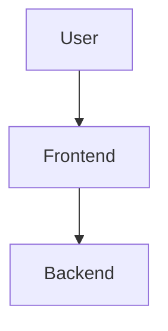
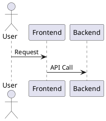

# System Diagrams

Complete set of UML and architectural diagrams for the **Course Recommendation Platform**.

---

## 📊 Available Diagrams

### 1. Class Diagram
Shows the object-oriented structure of the C++ backend.

**Files:**
- `class-diagram.mmd` - Mermaid format
- `class-diagram.puml` - PlantUML format

**Includes:**
- Models: `Course`, `UserProfile`, `Plan`, `PlanStep`
- Interfaces: `ICatalog`, `IStorage`, `IRecommenderStrategy`
- Implementations: `PostgresCatalog`, `PostgresStorage`, `GreedyRecommender`
- Services: `ScoringService`, `CrowServer`

---

### 2. Use Case Diagram
Shows user interactions with the system.

**Files:**
- `usecase-diagram.mmd` - Mermaid format
- `usecase.puml` - PlantUML format

**Primary Use Cases:**
- Browse course catalog
- Describe learning goals in natural language
- Generate personalized learning plans
- User authentication (register/login)
- Save/load/delete plans

---

### 3. Sequence Diagrams
Shows the flow of operations between components.

**Files:**
- `sequence-diagram-recommendation.mmd` - AI-powered recommendation flow (Mermaid)
- `sequence-recommendation.puml` - AI-powered recommendation flow (PlantUML)
- `sequence-diagram-auth.mmd` - Authentication flow (Mermaid)

**Key Flows:**
1. **Recommendation Flow**: User description → AI tag extraction → Greedy algorithm → Personalized roadmap
2. **Authentication Flow**: Registration, login, token validation

---

### 4. Component Diagram
Shows the architectural components and their relationships.

**Files:**
- `component-diagram.mmd` - Mermaid format

**Layers:**
- Client Layer: Web Browser
- Presentation Layer: FastAPI Frontend (Port 3000)
- AI Service Layer: Flask + Groq (Port 8081)
- Business Logic Layer: C++ Crow Backend (Port 8080)
- Data Layer: PostgreSQL Database

---

### 5. Deployment Diagram
Shows the physical deployment of the system.

**Files:**
- `deployment-diagram.mmd` - Mermaid format

**Environments:**
- Development: Docker Compose + Local processes
- Production: Nginx + Systemd services + Managed PostgreSQL

---

### 6. ER Diagram (Database Schema)
Shows the database structure and relationships.

**Files:**
- `er-diagram.mmd` - Mermaid format

**Tables:**
- `courses` (id, title, domain, level, duration_hours, tags[], prereq_ids[])
- `users` (id, username, email, password_hash, created_at)
- `plans` (user_id, total_hours, created_at)
- `plan_steps` (id, user_id, step, course_id, hours, note)

---

## 🛠️ How to Use These Diagrams

### Option 1: Draw.io (diagrams.net)

#### For Mermaid Files (.mmd)
1. Go to https://app.diagrams.net/
2. Click **Arrange → Insert → Advanced → Mermaid**
3. Copy paste the content from `.mmd` file
4. Click **Insert**
5. Diagram will be rendered and editable

#### For PlantUML Files (.puml)
1. Go to https://app.diagrams.net/
2. Click **Arrange → Insert → Advanced → PlantUML**
3. Copy paste the content from `.puml` file
4. Click **Insert**
5. Diagram will be rendered

### Option 2: PlantUML Online
1. Go to http://www.plantuml.com/plantuml/uml/
2. Paste the content from `.puml` files
3. View rendered diagram
4. Export as PNG/SVG

### Option 3: Mermaid Live Editor
1. Go to https://mermaid.live/
2. Paste the content from `.mmd` files
3. View rendered diagram
4. Export as PNG/SVG

### Option 4: VS Code Extensions

**For Mermaid:**
- Install: [Mermaid Preview](https://marketplace.visualstudio.com/items?itemName=vstirbu.vscode-mermaid-preview)
- Open `.mmd` file
- Press `Ctrl+Shift+P` → "Mermaid: Preview Diagram"

**For PlantUML:**
- Install: [PlantUML](https://marketplace.visualstudio.com/items?itemName=jebbs.plantuml)
- Open `.puml` file
- Press `Alt+D` to preview

### Option 5: Markdown Preview (GitHub/GitLab)
Mermaid diagrams are automatically rendered in GitHub/GitLab markdown:

````markdown
```mermaid
(paste mermaid diagram code here)
```
````

---

## 📐 Diagram Formats

### Mermaid (.mmd)
- Human-readable text format
- Widely supported (GitHub, GitLab, VS Code)
- Easy to version control
- Automatically rendered in many tools

### PlantUML (.puml)
- Standard UML diagram language
- More detailed control over layout
- Supported by many enterprise tools
- Better for complex class diagrams

---

## 🎨 Editing Diagrams

### Modify Mermaid Diagrams
Edit the text content directly. Example:



### Modify PlantUML Diagrams
Edit the text content directly. Example:



### Export Options
From draw.io:
- **PNG** - For documentation, presentations
- **SVG** - For scalable web graphics
- **PDF** - For printing
- **XML** - For draw.io native format

---

## 📚 Diagram Descriptions

### Class Diagram
**Purpose:** Understand the C++ backend architecture
**Use Case:** Onboarding new developers, architectural reviews
**Key Insight:** Interface-based design with dependency injection

### Use Case Diagram
**Purpose:** Understand what users can do with the system
**Use Case:** Requirements analysis, user story mapping
**Key Insight:** AI-powered natural language interface

### Sequence Diagrams
**Purpose:** Understand the flow of data through the system
**Use Case:** Debugging, performance optimization, integration testing
**Key Insight:** 3-tier architecture with AI service orchestration

### Component Diagram
**Purpose:** Understand the system's modular structure
**Use Case:** Microservices deployment, scaling decisions
**Key Insight:** Clean separation: UI, Business Logic, AI, Data

### Deployment Diagram
**Purpose:** Understand how the system is deployed
**Use Case:** DevOps setup, production deployment planning
**Key Insight:** Docker for development, systemd for production

### ER Diagram
**Purpose:** Understand the database schema
**Use Case:** Database migrations, query optimization
**Key Insight:** PostgreSQL arrays for tags and prerequisites

---

## 🔄 Keeping Diagrams Updated

When making code changes:
1. Update the relevant diagram files
2. Regenerate exports (PNG/SVG) if needed
3. Commit diagram source files (.mmd/.puml) to git
4. Update documentation references

**Automated Updates:**
- Consider using CI/CD to auto-generate diagram images
- Use git hooks to validate diagram syntax before commit

---

## 📖 Additional Resources

- [Mermaid Documentation](https://mermaid.js.org/)
- [PlantUML Documentation](https://plantuml.com/)
- [Draw.io User Guide](https://www.diagrams.net/doc/)
- [UML Best Practices](https://www.uml-diagrams.org/)

---

## 🤝 Contributing

When adding new diagrams:
1. Create both Mermaid (.mmd) and PlantUML (.puml) versions when possible
2. Follow existing naming conventions
3. Add descriptive comments in diagram code
4. Update this README with the new diagram description
5. Test rendering in at least one tool before committing

---

All diagrams are part of the **Course Recommendation Platform** documentation and reflect the current system architecture as of the latest commit.
